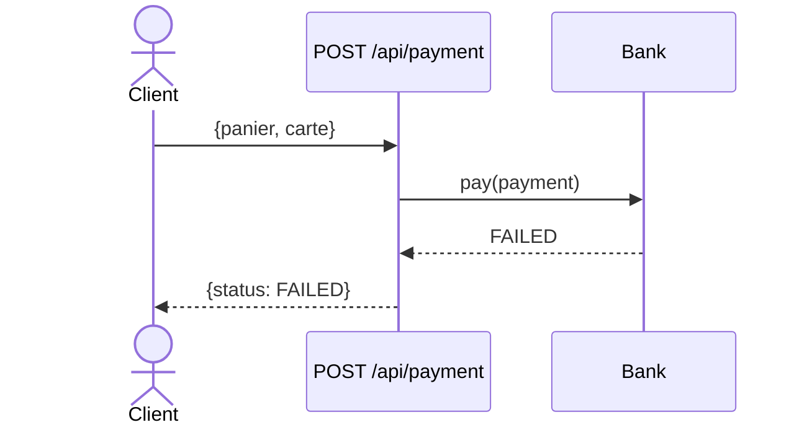
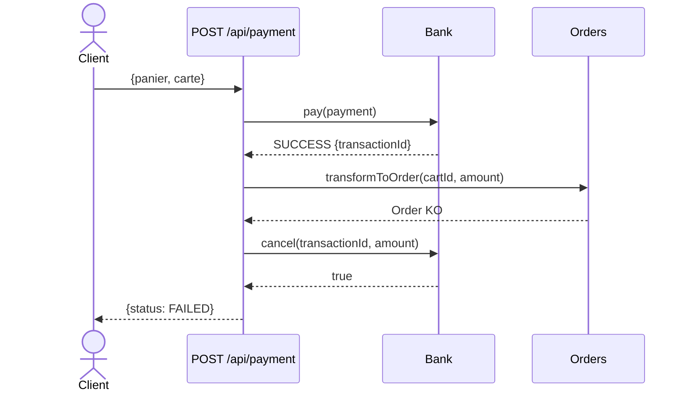
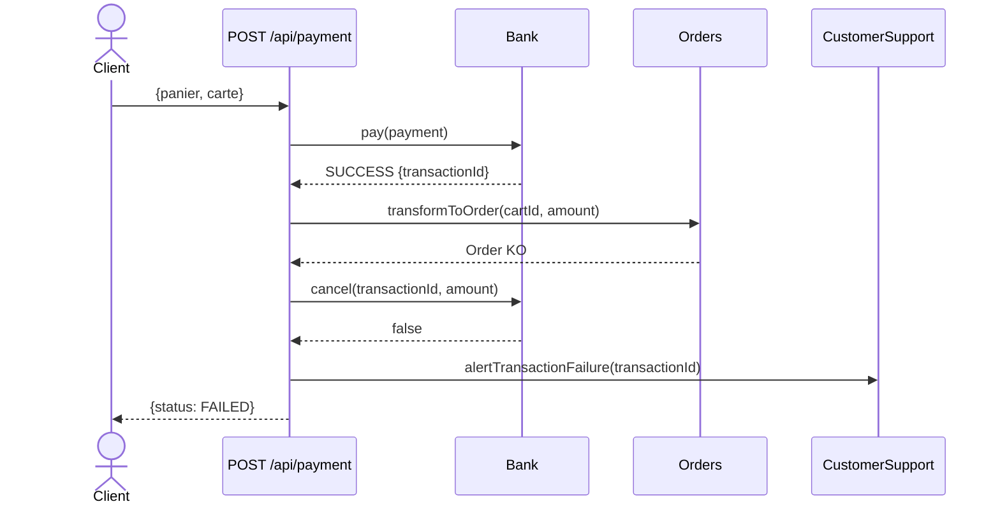
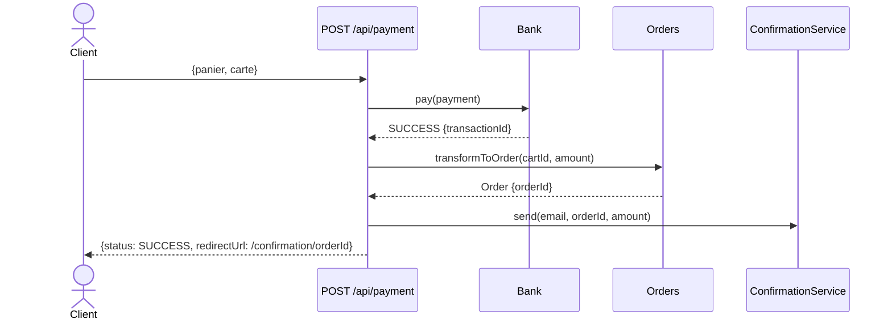
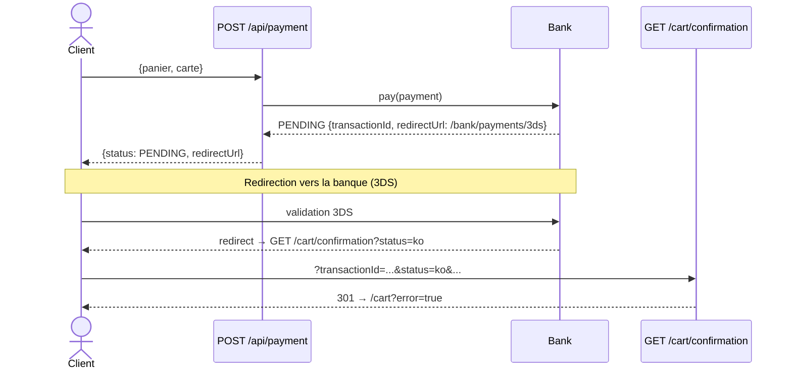
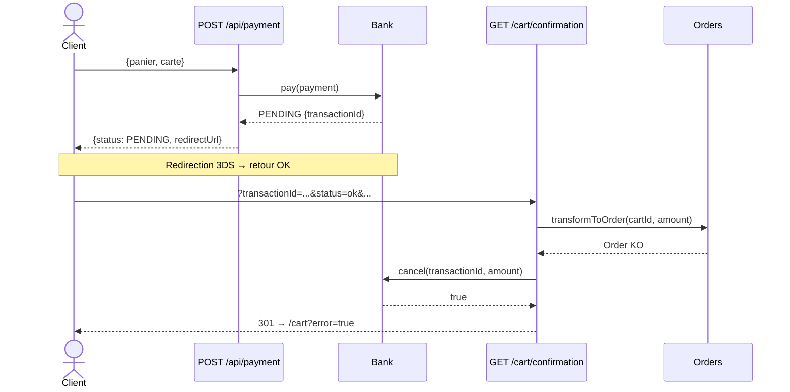
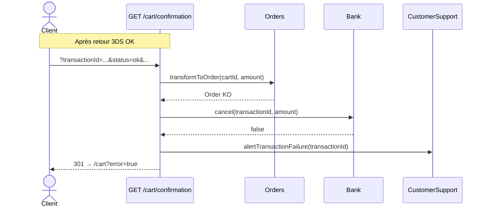
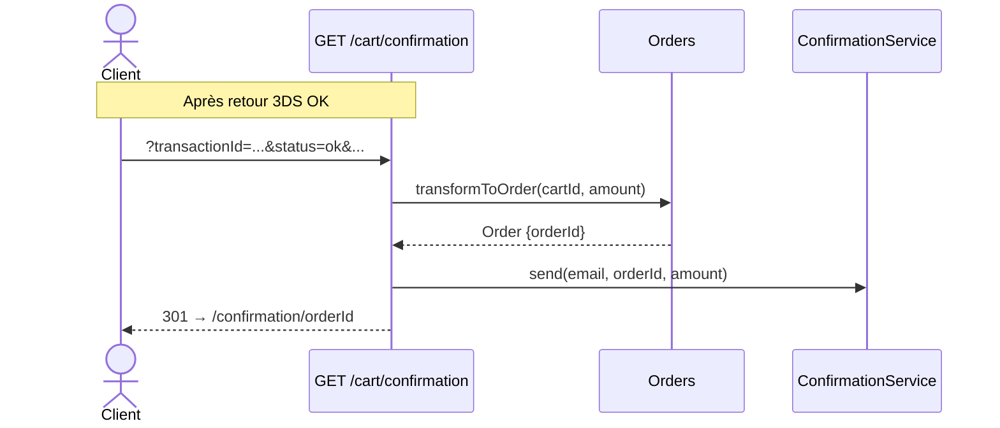
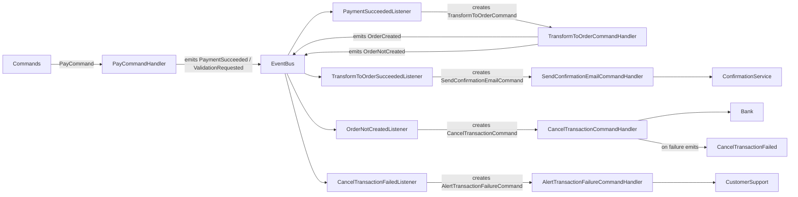

# Billetterie — Service de paiement

Application Spring Boot gérant le paiement d'un panier de billetterie, avec support du 3DS, transformation en commande et notification par email.

---

## Architecture

```
┌─────────────────────────────────────────────────────┐
│                  infrastructure                     │
│  PaymentController                                  │
│    ├── POST /api/payment                            │
│    └── GET  /api/payment/                           │
└──────────┬───────────────────────────┬──────────────┘
           │ ports (interfaces domain) │
    ┌──────▼──────┐           ┌────────▼────────┐
    │    Bank     │           │     Orders      │
    │  pay()      │           │ transformToOrder│
    │  cancel()   │           └────────┬────────┘
    └──────┬──────┘                    │
    ┌──────▼──────┐           ┌────────▼────────────────┐
    │  BankClient │           │      OrdersClient       │
    │  (HTTP)     │           │      (HTTP)             │
    └─────────────┘           └─────────────────────────┘

    ┌──────────────────┐   ┌──────────────────────────┐
    │  CustomerSupport │   │    ConfirmationService   │
    │ alertTransaction │   │       send()             │
    │  Failure()       │   └──────────┬───────────────┘
    └────────┬─────────┘              │
    ┌────────▼──────────┐   ┌─────────▼───────────────┐
    │ EmailCustomerSupp │   │ EmailConfirmationService│
    │ (email SMTP)      │   │ (email SMTP)            │
    └───────────────────┘   └─────────────────────────┘
```

---

## Endpoints

| Méthode | URL | Description |
|---------|-----|-------------|
| `POST` | `/api/payment` | Lance le paiement (sans 3DS ou demande 3DS) |
| `GET` | `/api/payment/cart/confirmation` | Callback banque après retour 3DS |
| `GET` | `/cart` | Affiche le panier (vue Thymeleaf) |
| `GET` | `/confirmation/{id}` | Page de confirmation de commande |

---

## Cas d'usage — Paiement sans 3DS (`POST /api/payment`)

| # | Banque | Transform commande | Annulation | Résultat |
|---|--------|--------------------|------------|----------|
| 1 | ❌ KO | — | — | FAILED — reste sur paiement |
| 2 | ✅ OK | ❌ KO | ✅ OK | FAILED — reste sur paiement |
| 3 | ✅ OK | ❌ KO | ❌ KO | FAILED + alerte support client |
| 4 | ✅ OK | ✅ OK | — | SUCCESS + email confirmation → page commande |

---

## Cas d'usage — Paiement avec 3DS (`GET /api/payment/cart/confirmation`)

| # | Retour banque | Transform commande | Annulation | Résultat |
|---|---------------|--------------------|------------|----------|
| 1 | ❌ `status=ko` | — | — | 301 → panier en erreur |
| 2 | ✅ `status=ok` | ❌ KO | ✅ OK | 301 → panier en erreur |
| 3 | ✅ `status=ok` | ❌ KO | ❌ KO | 301 → panier + alerte support |
| 4 | ✅ `status=ok` | ✅ OK | — | 301 → page confirmation + email |

---

## Diagrammes de séquence

### 1 — Sans 3DS : paiement KO



---

### 2 — Sans 3DS : paiement OK, commande KO, annulation OK



---

### 3 — Sans 3DS : paiement OK, commande KO, annulation KO



---

### 4 — Sans 3DS : paiement OK, commande OK



---

### 5 — Avec 3DS : demande de redirection, puis retour KO



---

### 6 — Avec 3DS : retour OK, commande KO, annulation OK



---

### 7 — Avec 3DS : retour OK, commande KO, annulation KO



---

### 8 — Avec 3DS : retour OK, commande OK



---

## Modèle de données (DTOs échangés)

### Requête paiement
| Champ | Type | Description |
|-------|------|-------------|
| `email` | String | Email du client |
| `cartDto.id` | String | Identifiant du panier |
| `cartDto.amount` | Float | Montant |
| `creditCardDto.number` | String | Numéro de carte |
| `creditCardDto.expirationDate` | String | Date d'expiration |
| `creditCardDto.cypher` | String | Cryptogramme |

### Réponse paiement
| Champ | Type | Valeurs |
|-------|------|---------|
| `status` | PaymentStatus | `PENDING` / `SUCCESS` / `FAILED` |
| `id` | String | orderId (si SUCCESS) |
| `amount` | Float | Montant (si non FAILED) |
| `transactionId` | String | ID transaction bancaire |
| `redirectUrl` | String | URL de redirection |


---

## Événements & chorégraphie

L'application utilise un pattern chorégraphié : les handlers de commandes émettent des événements, puis des listeners (enregistrés dans un `EventBus`) convertissent ces événements en nouvelles commandes qui sont renvoyées au `CommandBus`. Il n'y a pas d'orchestrateur central : la logique est répartie par événements.

Principaux événements produits par les use-cases / handlers :

- `PaymentSucceeded` : émis quand le paiement auprès de la `Bank` est confirmé (ou en cas de succès immédiat). Contient `transactionId`, `cartId`, `amount`, `email`.
- `ValidationRequested` : émis quand la banque demande une validation 3DS (status PENDING). Contient `transactionId`, `redirectUrl`, `amount`.
- `OrderCreated` : émis quand la transformation du panier en commande aboutit (contient `orderId`, `transactionId`, `amount`, `email`).
- `OrderNotCreated` : émis quand la transformation en commande échoue (contient `transactionId`, `cartId`, `amount`, `redirectUrl`).
- `CancelTransactionFailed` : émis si l'annulation auprès de la banque échoue après un `OrderNotCreated`.

Listeners (exemples) et comportement attendu :

- `PaymentSucceededListener` écoute `PaymentSucceeded` et retourne une `TransformToOrderCommand` (lance la transformation panier→commande).
- `TransformToOrderSucceededListener` écoute `TransformToOrderSucceeded` (ou utilise `OrderCreated`) et retourne une `SendConfirmationEmailCommand`.
- `OrderNotCreatedListener` écoute `OrderNotCreated` et retourne une `CancelTransactionCommand`.
- `CancelTransactionFailedListener` écoute `CancelTransactionFailed` et retourne une `AlertTransactionFailureCommand` (avertir support client).

Conséquence : les actions asynchrones (envois d'email, annulations, alertes) sont déclenchées par événement sans coupler directement les use-cases.

### Diagramme de la chorégraphie (graphe simplifié)


