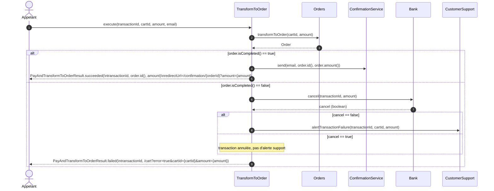

# TP : Orchestration vs Chorégraphie - Paiement Billetterie

## Objectif

Ce TP a pour but de comparer deux approches d'architecture pour la gestion du paiement dans une application de billetterie : **orchestration** et **chorégraphie**.

Vous allez implémenter deux approches d'implémentation du projet. L'objectif est de faire passer tous les tests unitaires et d'intégration pour les deux approches, puis de comparer les deux implémentations selon différents critères (complexité, maintenabilité, scalabilité, etc.) pour mieux comprendre les avantages et inconvénients de chaque approche.

---

## Étapes à suivre

### 1) Choix de l'approche
Commencez par choisir **une implémentation** : 
#### a) Implémentation use cases - environ 15 - 20 min (2 branches plus ou moins guidées)

Conseil : ne passez pas trop de temps sur l'implémentation de l'orchestration, ce qui est plus intéressant est de voir les différences d'implémentation entre les deux approches et de faire la comparaison ensuite.

Vous pouvez faire l'implémentation très guidée pour l'orchestration pour aller plus vite et vous concentrer sur la chorégraphie qui est plus complexe à implémenter.

##### a.1) Implémentation use cases très guidée
Basculez sur la branche `conference/email/workshop/implementation/use-cases` pour une implémentation très guidée (méthodes à appeler avec des aides sur les paramètres) à l'aide de TODOs et des tests unitaires.

Vous n'avez quasiment qu'à décommenter les TODOs et faire passer les tests unitaires progressivement au vert pour implémenter la logique métier.
```bash
git checkout conference/email/workshop/implementation/use-cases
 ```

exemple de TODO très guidé :
```java
        //TODO: call bank.pay with new Payment(cartId, cardNumber, expirationDate, cypher, amount, email)

        //TODO: check if transaction isPending() then return
        // PayAndTransformToOrderResult.pending(
        //                    transaction.id(),
        //                    transaction.redirectionUrl(),
        //                    amount,
        //                    email);

        //TODO: check if transaction NOT hasSucceeded() then return
        // PayAndTransformToOrderResult.failed(
        //                    transaction.id());
```
##### a.2) Implémentation use cases
Basculez sur la branche `conference/email/workshop/implementation/use-cases-with-few-guidance` pour une implémentation n'indiquant que les grandes étapes du workflow et les ports à appeler à l'aide de TODOs et des tests unitaires.

Vous devrez découvrir par vous-même les méthodes à appeler et les paramètres à passer pour faire passer les tests unitaires progressivement au vert pour implémenter la logique métier. Vous devrez faire plus attention aux assertions des tests unitaires pour comprendre les attentes fonctionnelles et trouver les méthodes à appeler et les paramètres à passer.
```bash
git checkout conference/email/workshop/implementation/use-cases-with-few-guidance
 ```

exemple de TODOs simplifié :
```java
        //TODO: pay the order, see bank.pay(...)

        //TODO: check if transaction isPending() then return pending result, see PayAndTransformToOrderResult.pending(...)

        //TODO: check if transaction NOT hasSucceeded() then return failed, see PayAndTransformToOrderResult.failed(...)
```

#### Solution orchestration
Vous pouvez aussi consulter la branche `conference/email/workshop/implementation/solution/use-cases` pour voir une solution d'implémentation des use cases.
```bash
git checkout conference/email/workshop/implementation/solution/use-cases 
```

#### b) Implémentation chorégraphie - environ 30 - 40 min
Basculez sur la branche `conference/email/workshop/implementation/choregraphy`

```bash
git checkout conference/email/workshop/implementation/choregraphy 
```
#### Solution chorégraphie
Vous pouvez aussi consulter la branche `conference/email/workshop/implementation/solution/use-cases` pour voir une solution d'implémentation des use cases.
```bash
git checkout conference/email/workshop/implementation/solution/choregraphy
```

### 2) Implémentation
   - Implémentez la logique métier **uniquement** dans l'un de ces packages* :
     - pour l'approche orchestration : 
       - `com.billetterie.payment.orchestration`
     - pour l'approche chorégraphie :
       - `com.billetterie.payment.choregraphy`
       - * : il faut aussi implémenter la classe `com.billetterie.payment.common.cqrs.middleware.command.CommandBusFactory`
   - Suivez les TODOs présents dans les classes pour guider votre implémentation et vérifier que les tests unitaires passent progressivement au vert.
   - N'ajoutez pas de logique métier en dehors de ces packages.
   - Nous n'avez normalement pas besoin de modifier les tests unitaires ou cucumber
   - Vous n'avez pas besoin de rajouter de classe pour l'orchestration, vous devez réutiliser les classes déjà présentes dans le projet.
   - Vous n'avez normalement pas besoin de rajouter de classes pour la chorégraphie, vous devez réutiliser les classes déjà présentes dans le projet mais vous pouvez décider d'implementer l'orchestration dans d'autres classes de service si vous le souhaitez.

#### Orchestration :
Voici un diagramme de séquence simplifié de l'implémentation d'orchestration attendue :


#### Chorégraphie :
Voici un diagramme de séquence simplifié de l'implémentation de chorégraphie attendue :

```mermaid
flowchart LR
%% Command -> Handler -> Event
    C1[PayCommand] --> H1[PayCommandHandler]
    H1 --> E1[PaymentSucceeded]
    H1 --> E2[ValidationRequested]
    H1 --> E3[TransactionFailed]

%% Event -> Listener -> Command
    E1 --> L1[PaymentSucceededListener]
    L1 --> C2[TransformToOrderCommand]

%% Command -> Handler -> Event
    C2 --> H2[TransformToOrderCommandHandler]
    H2 --> E4[TransformToOrderSucceeded]
    H2 --> E5[OrderNotCreated]

%% Event -> Listener -> Command
    E4 --> L2[TransformToOrderSucceededListener]
    L2 --> C3[SendConfirmationEmailCommand]

%% Command -> Handler -> Event
    C3 --> H3[SendConfirmationEmailCommandHandler]
    H3 --> E6[ConfirmationEmailSent]

%% Event -> Listener -> Command
    E5 --> L3[OrderNotCreatedListener]
    L3 --> C4[CancelTransactionCommand]

%% Command -> Handler -> Event
    C4 --> H4[CancelTransactionCommandHandler]
    H4 --> E7[CancelTransactionSucceeded]
    H4 --> E8[CancelTransactionFailed]

%% Event -> Listener -> Command
    E8 --> L4[CancelTransactionFailedListener]
    L4 --> C5[AlertTransactionFailureCommand]

%% Command -> Handler -> Event
    C5 --> H5[AlertTransactionFailureCommandHandler]
    H5 --> E9[CustomerSupportAlerted]
```


### 3) Tests 
#### Tests unitaires
   - Faites passer tous les tests unitaires fournis.
   - Suivez l'ordre des tests selon leur nom `Test1`, `Test2`, etc. pour faciliter le développement.'

```bash
./gradlew :test
```

#### Tests d'intégration (Cucumber)
   - Une fois les tests unitaires validés, exécutez les tests Cucumber pour valider l'intégration de bout en bout.

```bash
./gradlew :cucumberCli
```

### 4) Comparaison des approches
Une fois l'implémentation choisie réalisée, tous les tests unitaires et d'intégration passés, vous pouvez changer de branche et faire l'autre implémentation pour comparer les deux approches.

Vous pouvez comparer les deux approches selon les critères suivants :
 - Complexité de l'implémentation
 - Facilité de maintenance
 - Scalabilité
 - Couplage entre les composants
 - Facilité à faire évoluer la logique métier ou ajouter de nouvelles fonctionnalités
---

## Conseils

- Commencez par comprendre les tests unitaires et les scénarios Cucumber pour bien cerner les attentes fonctionnelles.
- Travaillez par petites étapes : faites passer un test à la fois.
- En cas de difficulté, relisez les exemples fournis dans le projet et les diagrammes ci-dessus.

---

Bon courage !
